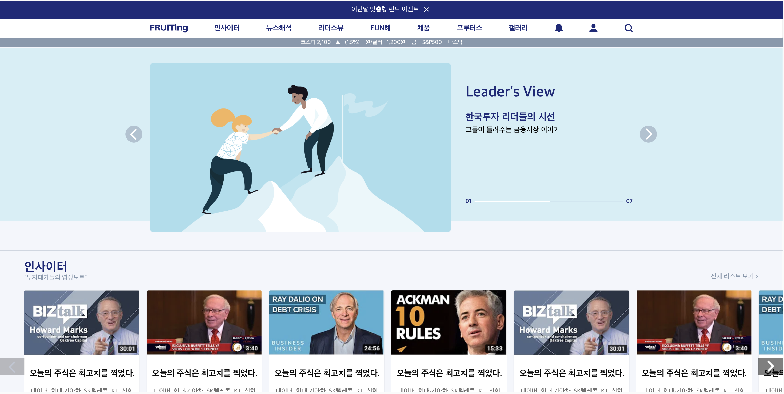

# **🖥️ 만능 개발자 문성민!**

## 📜 목차
1. 👨🏻‍💻 [간단 소개](#1-간단-소개)
2. 🏆 [수상 경력](#2-수상-경력)
3. ⏰ [나의 경력](#3-나의-경력)
    - [프리랜서 프로젝트](#프리랜서-프로젝트)
    - [타이아 주식회사(2020-11-07~재직중)](#타이아-주식회사2020-11-07재직중)
4. ☎️ [Contact](#contact)

---

### 1. 간단 소개

> 안녕하세요! ***"매일 새로운 개발 하며 도전하는"*** 개발자 문성민입니다.
> 고등학교에 다닐 때부터 웹 개발을 시작하여 꾸준히 도전하며 새로운 개발 언어 공부하는 걸 좋아하여 ***"어떠한 환경에서도 적응"*** 할 수 있습니다.   

- 프론트엔드 기술 역량 : React, Vue.js(Composition API), Next.js, Styled Components, Javascript(ES6), Typescript, Jquery, Bootstrap
- 백엔드 기술 역량 : JAVA, Spring, MYBATIS, JSP, Express, PHP
- 데이터베이스 기술 역량 : MYSQL, MSSQL, PostgreSQL, MongoDB

---

### 2. 수상 경력

1. 2018 전국기능경기대회
    - *수여 기관 : 국제기능올림픽대회 한국위원회*
    - *수여내용 : 2018 전국기능경기대회 웹디자인 및 개발 직종 우수상*
2. 2017 전국기능경기대회
    - *수여 기관 : 국제기능올림픽대회 한국위원회*
    - *수여내용 : 2017 전국기능경기대회 웹디자인 및 개발 직종 장려상*
3. 2018 지방기능경기대회
    - *수여 기관 : 광주광역시 기능경기위원회*
    - *수여내용 : 2018 지방기능경기대회 웹디자인 및 개발 직종 금메달*
4. 2017 지방기능경기대회
    - *수여 기관 : 광주광역시 기능경기위원회*
    - *수여내용 : 2017 지방기능경기대회 웹디자인 및 개발 직종 은메달*
5. 2016 지방기능경기대회
    - *수여 기관 : 광주광역시 기능경기위원회*
    - *수여내용 : 2016 지방기능경기대회 웹디자인 및 개발 직종 은메달*

---

### 3. 나의 경력

#### 프리랜서 프로젝트

- 고등학교에 다닐 때부터 웹 개발을 시작하여 프리랜서로 개발하면서 약 3~40개 프로젝트를 하였습니다. 

 

#### 펫츠레이팅 메인 화면

> 프론트엔드 영역을 개발하였습니다.  
> React 프레임워크인 Next.js를 사용하여 개발하였으며, 디자이너와 협업하여 개발하였습니다.

 

- 펫츠레이팅 개발(약 15 페이지)
    - 프론트엔드
      - React
      - Next.js
      - Styled Components
      - SCSS
      - Bootstrap 
    - 협업 프로그램
      - Adobe XD

- [프로젝트 보기](/portfolio/petsratings/README.md)

---

#### 프루팅 메인 화면

> React 프레임워크인 Next.js를 사용하였으며, 백엔드 개발자, 웹 디자이너와 협업하여 개발하였습니다.

 

- 프루팅 개발(약 15 페이지)
    - 프론트엔드
      - React
      - Next.js
      - Styled Components
      - Redux Saga
      - SCSS
      - Bootstrap 
    - 협업 프로그램
      - Asana
      - Postman
      - Adobe XD
    - 서버
      - AWS EC2

- [프로젝트 보기](https://www.fruiting.co.kr/)

---

#### 펫포레스트 메인 화면

> PHP와 Jquery를 사용하였으며, 웹 디자이너와 협업하여 개발하였습니다.

 

- 펫포레스트 개발(약 15 페이지)
    - 프론트엔드
      - Jquery
      - Bootstrap
    - 백엔드
      - PHP
    - 데이터베이스
      - MYSQL
    - 협업 프로그램
      - Adobe photoshop
    - 서버
      - CAFE24 웹 호스팅

- [프로젝트 보기](https://www.petforest.co.kr/)

 

### 타이아 주식회사(2020-11-07~재직중)

1. 개발에 사용한 언어
    - 프론트엔드
      - Jquery
      - Bootstrap
    - 백엔드
      - JSP
      - Java
      - Spring MVC
    - 데이터 베이스
      - MSSQL
      - PostgreSQL
    - 협업 프로그램
      - Subversion
      - Adobe XD
      - Zeplin
      - Adobe Photoshop
2. 개발 업무
    - 자사 MES 웹 개발
    - 자동차 국내 기업 MES 웹 유지보수
    - 특정 지역 스마트 팩토리 개발

---

### Contact
- 📧 이메일 : tjdals394@gmail.com
- 📘 블로그 : https://nakknakk2.tistory.com
- 📚 깃허브 : https://github.com/home-king-00